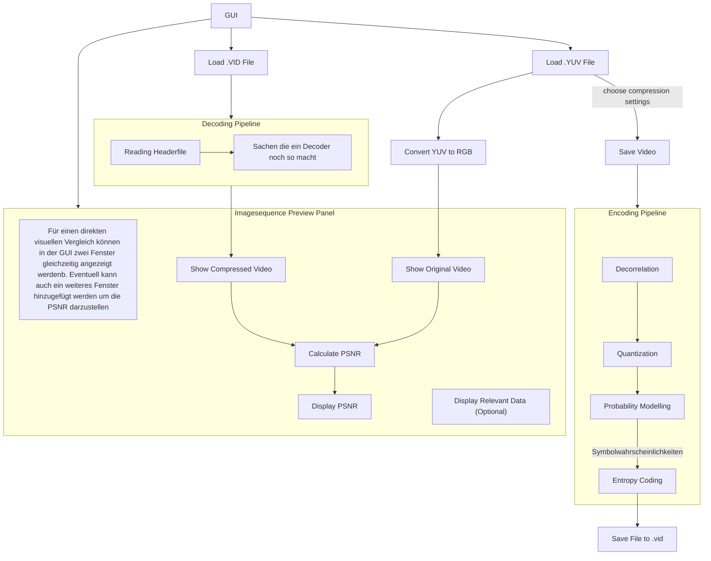

# VidKomp

# Architektur
> [!NOTE] 
> Manchmal kann die Mermaid Syntax in VSCode nicht angezeigt werden. Dafür einfach die Extension `Markdown Preview Mermaid Support` runterladen.

Einfachshalber würde ich vorschlagen, dass der Player nur YUV und unser VID Format einlesen kann. Falls wir mehr Beipielvideos brauchen können wir ein belibiges Dateiformat in per `ffmpeg` in YUV konvertieren.

